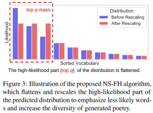

# Implementation of language model decoding algorithms

This repository contains implementations of several decoding algorithms for autoregressive language models. These methods are based on recent research papers and are not currently available in the `transformers` library.

The implementations were developed for testing these algorithms in Russian-language syllabo-tonic poetry generation, with a focus on improving lexical diversity in creative text generation. These implementations may be useful for researchers working with language models and creative AI applications.

## Nucleus Sampling with Flattened Head

This sampling algorithm is described in [Lingxi: A Diversity-aware Chinese Modern Poetry Generation System](https://aclanthology.org/2023.acl-demo.6.pdf). The core concept is illustrated below:



The implementation in [ns_flattened_head_sampling.py](ns_flattened_head_sampling.py) extends the [top-p logit processor in transformers](https://huggingface.co/docs/transformers.js/en/api/generation/logits_process#new-topplogitswarpertopp-options). The algorithm works as follows:

1. The **top-q** portion of logits are flattened: summed, divided by the size of the top-q subset, and reset to this value
2. The standard **top-p** algorithm is then applied, setting the low-confidence tail of the distribution to -inf

The constructor accepts both `top_p` and `top_q` arguments:

```python
import transformers

logits_processor = transformers.generation.logits_process.LogitsProcessorList()
logits_processor.append(NucleusSamplingWithFlattenedHead(top_q=0.30, top_p=0.50))
```

To use with model generation:

```python

tokenizer = transformers.AutoTokenizer.from_pretrained(...)
model = transformers.AutoModelForCausalLM.from_pretrained(...)

with torch.no_grad():
  out_ids = model.generate(...,
                           logits_processor=logits_processor,
                           do_sample=generation_args['do_sample'],
                           temperature=generation_args['temperature'],
                          )
```

### Top-nσ sampling

This algorightm is presented in [Top-nσ: Eliminating Noise in Logit Space for Robust Token Sampling of LLM](https://aclanthology.org/2025.acl-long.528.pdf):


Implementation for using with `transformers` is available as [TopNSigmaFilter](top_nsigma_filter.py).

The constructor accepts only the `n_sigma` argument corresponding to `n` parameter in the algorithm:

```python
import transformers

logits_processor = transformers.generation.logits_process.LogitsProcessorList()
logits_processor.append(TopNSigmaFilter(n_sigma=0.8))
```

Then you pass `logits_processor` to the model's `generation` method as it was shown in previous section.


